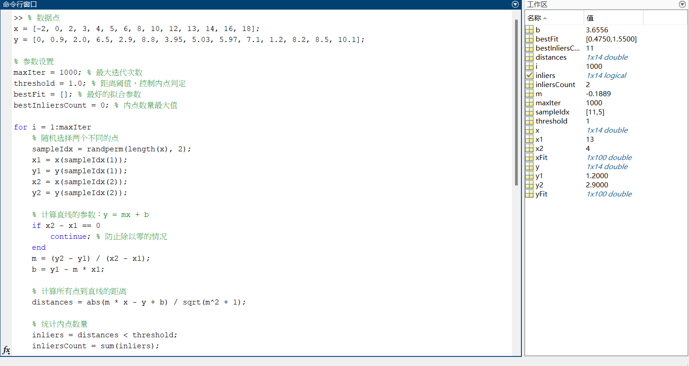
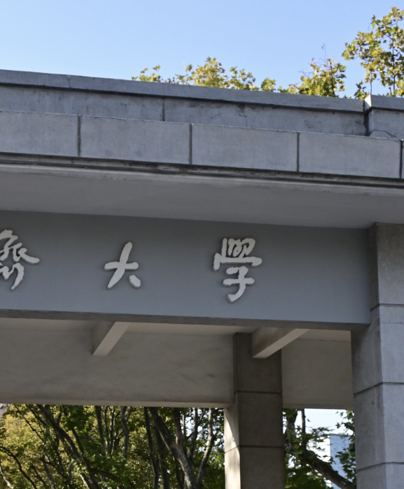
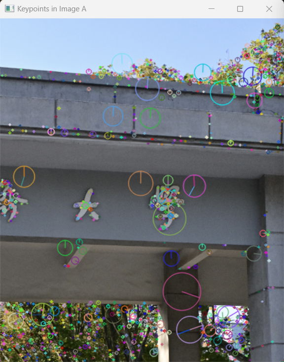
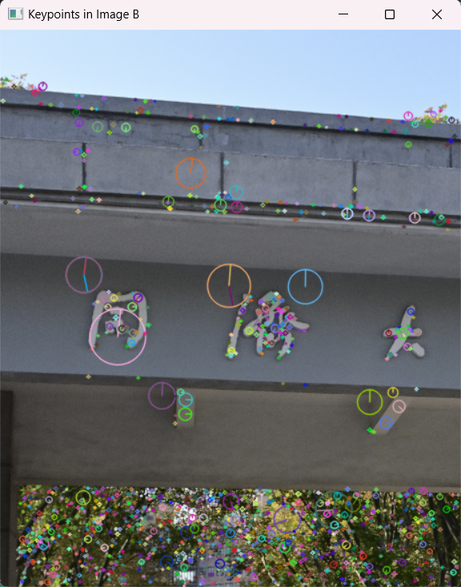
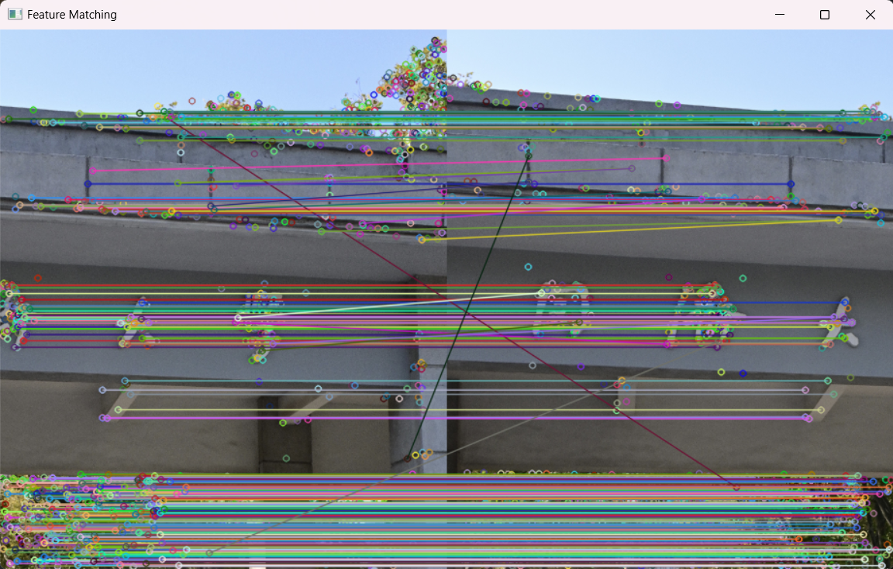
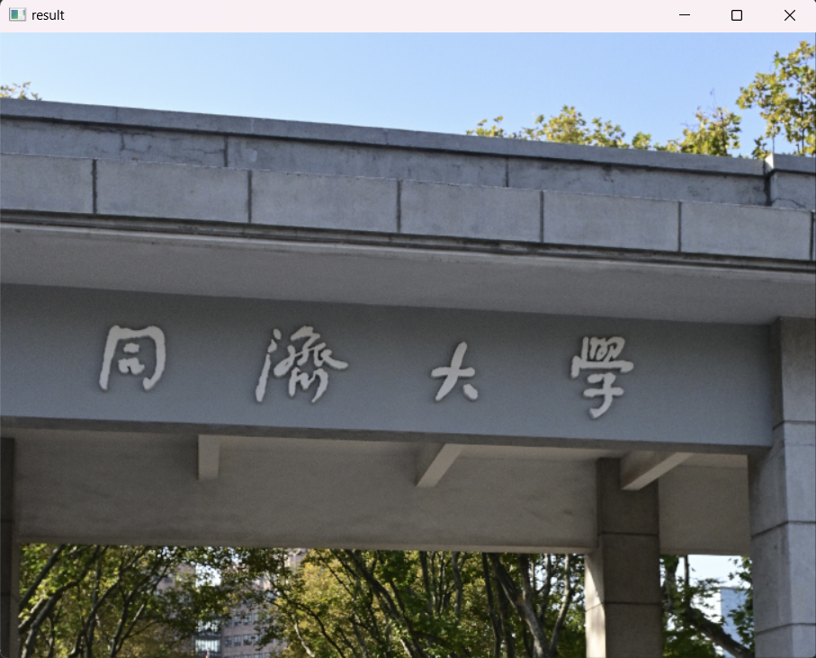
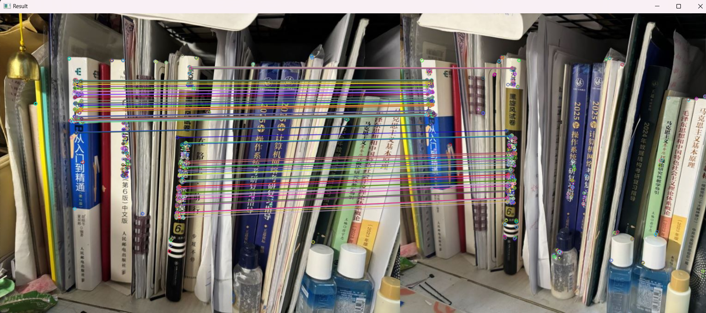

# Homework 1

Tongji University · Class of 2022 · School of Computer Science and Technology · Software Engineering · Machine Intelligence Direction · Computer Vision Coursework

Teacher: Lin Zhang

Semester of instruction: 2024-2025, autumn semester

2251730 Shuyi Liu

## Prove that the set of matrices \(\{M_i\}\) constitutes the group

To prove that the matrix set \(\{M_i\}\) forms a group, we need to verify that it satisfies the four group properties: **closure**, **associativity**, **existence of identity element**, and **existence of inverse element**. The specific steps are as follows:

### 1. Closedness
The closedness requirement states that for any two transformation matrices \(M_i\) and \(M_j\), their product \(M_i M_j\) must also belong to the set \(\{M_i\}\).

Assume \( M_i \) and \( M_j \) are in the form:
\[
M_i = \begin{bmatrix} R_i & t_i \\ 0^T & 1 \end{bmatrix}, \quad
M_j = \begin{bmatrix} R_j & t_j \\ 0^T & 1 \end{bmatrix}
\]

We calculate the product \( M_i M_j \):
\[
M_i M_j = \begin{bmatrix} R_i & t_i \\ 0^T & 1 \end{bmatrix} \begin{bmatrix} R_j & t_j \\ 0^T & 1 \end{bmatrix} = \begin{bmatrix} R_i R_j & R_i t_j + t_i \\ 0^T & 1 \end{bmatrix}
\]
The result is still in the same form, where the top-left block is \( R_i R_j \).
Since \( R_i \) and \( R_j \) are orthogonal matrices, i.e.:
\[
R_i^T R_i = I, \quad R_j^T R_j = I
\]

We need to demonstrate that \( R_i R_j \) is also an orthogonal matrix, i.e., \( (R_i R_j)^T (R_i R_j) = I \).

First, calculate \( (R_i R_j)^T \):
\[
(R_i R_j)^T = R_j^T R_i^T
\]

Then, we proceed with:
\[
(R_i R_j)^T (R_i R_j) = R_j^T R_i^T R_i R_j
\]

Given that \( R_i \) and \( R_j \) are orthogonal, \( R_i^T R_i = I \) and \( R_j^T R_j = I \), we simplify this to:
\[
R_j^T (R_i^T R_i) R_j = R_j^T I R_j = R_j^T R_j = I
\]

This confirms that \( (R_i R_j)^T (R_i R_j) = I \), hence \( R_i R_j \) is orthogonal.

The top-right block, \( R_i t_j + t_i \), represents a translation vector, and the last row is \([0^T, 1]\). Therefore, the product \( M_i M_j \) remains within \(\{M_i\}\), satisfying the closedness property.

### 2. Associativity
The associativity requirement dictates that for any three transformation matrices \( M_i, M_j, M_k \), the relation \( (M_i M_j) M_k = M_i (M_j M_k) \) holds.

For any three matrices \( M_i, M_j, M_k \) from \(\{M_i\}\), we can compute:
\[
(M_i \times M_j) \times M_k = \left(\begin{bmatrix} R_i & t_i \\ 0^T & 1 \end{bmatrix} \begin{bmatrix} R_j & t_j \\ 0^T & 1 \end{bmatrix}\right) \begin{bmatrix} R_k & t_k \\ 0^T & 1 \end{bmatrix}
\]
\[
= \begin{bmatrix} R_i R_j & R_i t_j + t_i \\ 0^T & 1 \end{bmatrix} \begin{bmatrix} R_k & t_k \\ 0^T & 1 \end{bmatrix} = \begin{bmatrix} R_i R_j R_k & R_i R_j t_k + R_i t_j + t_i \\ 0^T & 1 \end{bmatrix}
\]

Similarly:
\[
M_i \times (M_j \times M_k) = \begin{bmatrix} R_i & t_i \\ 0^T & 1 \end{bmatrix} \left(\begin{bmatrix} R_j & t_j \\ 0^T & 1 \end{bmatrix} \begin{bmatrix} R_k & t_k \\ 0^T & 1 \end{bmatrix}\right)
\]
\[
= \begin{bmatrix} R_i & t_i \\ 0^T & 1 \end{bmatrix} \begin{bmatrix} R_j R_k & R_j t_k + t_j \\ 0^T & 1 \end{bmatrix} = \begin{bmatrix} R_i R_j R_k & R_i R_j t_k + R_i t_j + t_i \\ 0^T & 1 \end{bmatrix}
\]

Therefore:
\[
(M_i \times M_j) \times M_k = M_i \times (M_j \times M_k)
\]

Matrix multiplication in homogeneous coordinates preserves the associative property, ensuring \( M_i, M_j, M_k \) follow the associative rule, thus confirming associativity.

### 3. Identity Transformation
The identity transformation requirement asserts that there exists a matrix \( M_e \in \{M_i\} \) such that \( M_e M_i = M_i M_e = M_i \) for any \( M_i \).

Define the identity matrix as:
\[
M_e = \begin{bmatrix} I_{3 \times 3} & 0 \\ 0^T & 1 \end{bmatrix}
\]
where \(I_3\) is the \(3 \times 3\) identity matrix, and 0 is a \(3 \times 1\) zero vector.

Verification:
\[
M_e M_i = \begin{bmatrix} I_{3 \times 3} & 0 \\ 0^T & 1 \end{bmatrix} \begin{bmatrix} R_i & t_i \\ 0^T & 1 \end{bmatrix} = \begin{bmatrix} R_i & t_i \\ 0^T & 1 \end{bmatrix} = M_i
\]
Similarly:
\[
M_i M_e = \begin{bmatrix} R_i & t_i \\ 0^T & 1 \end{bmatrix} \begin{bmatrix} I_{3 \times 3} & 0 \\ 0^T & 1 \end{bmatrix} = \begin{bmatrix} R_i & t_i \\ 0^T & 1 \end{bmatrix} = M_i
\]
Thus, \( M_e \) functions as the identity element, confirming its existence.

### 4. Inverse Transformation
The inverse requirement specifies that for each \( M_i \), there must be an inverse matrix \( M_i^{-1} \) such that \( M_i M_i^{-1} = M_i^{-1} M_i = M_e \).

We construct the inverse as:
\[
M_i^{-1} = \begin{bmatrix} R_i^T & -R_i^T t_i \\ 0^T & 1 \end{bmatrix}
\]
Verification:
\[
M_i M_i^{-1} = \begin{bmatrix} R_i & t_i \\ 0^T & 1 \end{bmatrix} \begin{bmatrix} R_i^T & -R_i^T t_i \\ 0^T & 1 \end{bmatrix} = \begin{bmatrix} R_i R_i^T & R_i (-R_i^T t_i) + t_i \\ 0^T & 1 \end{bmatrix} = \begin{bmatrix} I_3 & 0 \\ 0^T & 1 \end{bmatrix} = M_e
\]
It confirms that \( M_i^{-1} \) is the inverse of \( M_i \), thus validating the existence of an inverse.

### Conclusion
Through the proof of closedness, associativity, the existence of an identity element, and the existence of inverse elements, we conclude that \(\{M_i\}\) constitutes a group under matrix multiplication.

## Harris Corner Detector's Matrix Properties

### 1. Prove that matrix \( M \) is semi-positive definite

First, the matrix \( M \) is a symmetric matrix, represented as:

\[
M = \begin{bmatrix} 
\sum_{(x_i, y_i) \in w} (I_x)^2 & \sum_{(x_i, y_i) \in w} (I_x I_y) \\
\sum_{(x_i, y_i) \in w} (I_x I_y) & \sum_{(x_i, y_i) \in w} (I_y)^2 
\end{bmatrix}
\]

To prove that \( M \) is semi-positive definite, we need to verify that for any vector \( v = \begin{bmatrix} v_x \\ v_y \end{bmatrix} \), we have:

\[
v^T M v \geq 0
\]

Substituting the specific expression, and expanding it, we get:

\[
v^T M v = v_x^2 \sum (I_x)^2 + 2 v_x v_y \sum (I_x I_y) + v_y^2 \sum (I_y)^2
\]

This expression is a quadratic form of the sum and product of local image gradient squares. Since the image gradients \( I_x \) and \( I_y \) are real numbers, and their sum and product of squares are non-negative, this quadratic form is always non-negative.

Thus, for any vector \( v \), \( v^T M v \geq 0 \), proving that matrix \( M \) is semi-positive definite.

### 2. When \( M \) is positive definite, the equation \( [x, y] M \begin{bmatrix} x \\ y \end{bmatrix} = 1 \) represents an ellipse

If matrix \( M \) is positive definite, it can be expressed via eigen decomposition as:

\[
M = Q \Lambda Q^T
\]

where \( Q \) is an orthogonal matrix, and \( \Lambda \) is a diagonal matrix containing the two positive eigenvalues \( \lambda_1 \) and \( \lambda_2 \) of \( M \).

Substituting this into the original equation:

\[
[x, y] M \begin{bmatrix} x \\ y \end{bmatrix} = 1
\]

We get:

\[
[x', y'] \Lambda \begin{bmatrix} x' \\ y' \end{bmatrix} = 1
\]

where \( \begin{bmatrix} x' \\ y' \end{bmatrix} = Q^T \begin{bmatrix} x \\ y \end{bmatrix} \) represents a coordinate rotation.

Expanding this gives:

\[
\lambda_1 (x')^2 + \lambda_2 (y')^2 = 1
\]

This is the standard equation of an ellipse, hence the equation represents an ellipse.

### 3. Lengths of the major and minor axes of the ellipse

We have the standard equation of the ellipse:

\[
\lambda_1 (x')^2 + \lambda_2 (y')^2 = 1
\]

According to the geometric properties of ellipses, the lengths of the major and minor axes are inversely proportional to the eigenvalues \( \lambda_1 \) and \( \lambda_2 \). Therefore:

- The major axis corresponds to the smaller eigenvalue \( \lambda_2 \), and its length is \( \frac{1}{\sqrt{\lambda_2}} \).
- The minor axis corresponds to the larger eigenvalue \( \lambda_1 \), and its length is \( \frac{1}{\sqrt{\lambda_1}} \).

Thus proven.

## Proving the Nonsingularity of \(A^T A\)

To prove that \( A^T A \) is nonsingular (invertible), we can analyze it through the following steps:

### 1. Matrix \( A^T A \) is a Symmetric Matrix
First, note that \( A^T A \) is a symmetric matrix. This is because for any matrix \( A \), we have:
\[
(A^T A)^T = A^T (A^T)^T = A^T A
\]
Thus, \( A^T A \) is symmetric.

### 2. Rank of Matrix \( A^T A \) and Matrix \( A \)
The rank of \( A^T A \) is the same as the rank of \( A \). This is because the rank of \( A^T A \) is directly related to whether the column vectors of matrix \( A \) are linearly independent. If we know that \( {rank}(A) = n \), then the column vectors of \( A \) are linearly independent.

- If the column vectors of \( A \) are linearly independent, then the rank of \( A^T A \) is also \( n \), meaning \( A^T A \) is a full-rank matrix.
- For an \( n × n \) square matrix, if it is full-rank, then it is invertible.

### 3. Proving that \( A^T A \) is Positive Definite
We can deduce that \( A^T A \) is invertible by proving that it is a positive definite matrix.

For any non-zero vector \( x \in \mathbb{R}^n \), consider \( x^T A^T A x \):
\[
x^T A^T A x = (A x)^T (A x) = \| A x \|^2
\]
where \( \| A x \|^2 \) denotes the square of the 2-norm of \( A x \).

Since the column vectors of \( A \) are linearly independent, and \( A \in \mathbb{R}^{m×n} \) (with \( m > n \) and \( {rank}(A) = n \)), for any \( x ≠ 0 \), we have \( A x ≠ 0 \). Therefore:
\[
\| A x \|^2 > 0 \quad {for any} \, x ≠ 0
\]
This means that \( x^T A^T A x > 0 \) for any non-zero vector \( x \), implying that \( A^T A \) is positive definite.

### 4. Positive Definite Matrices are Invertible
Since \( A^T A \) is positive definite, it follows that \( A^T A \) is nonsingular (invertible).

Thus, \( A^T A \) is a nonsingular matrix, meaning it is invertible.

## Using RANSAC to Fit a 2D Line

In MatLab, the built-in `fit` function combined with the RANSAC algorithm can be used to fit a line and graphically display the fitting results.

Environment: Windows 11

Platform: MatLab 2023b

Libraries: Base Numeric Functions, Plotting Functions

Code location: ../Program/Prog4.m

### Result is as follows: 

## LoG (or DoG) and SIFT based image stitching

Environment: Windows 11

Platform: PyCharm Professional 2024.1.4

Python version: 3.12.4

Python libraries: numpy opencv-Python

Code location: ../Program/Prog5.py

### Results are as follows:

#### Original image

    
    

#### Key-points detection

    
    

#### Matching results

#### splicing result

## 基于OpenCV的ORB特征点检测与匹配算法实现

Environment: Windows 11

Platform: Visual Studio 2022

Libraries: opencv 4.10.0

Code location: ./Program/Prog6

### Results are as follows:

#### Original image

    
    

#### Matching results

