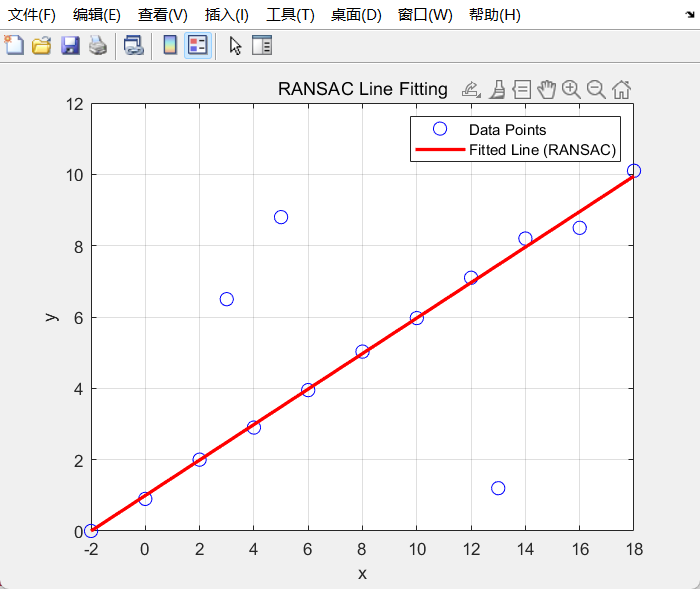
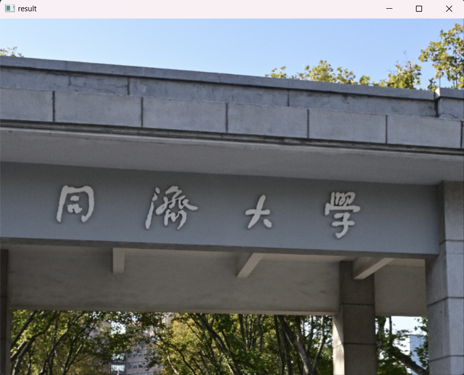
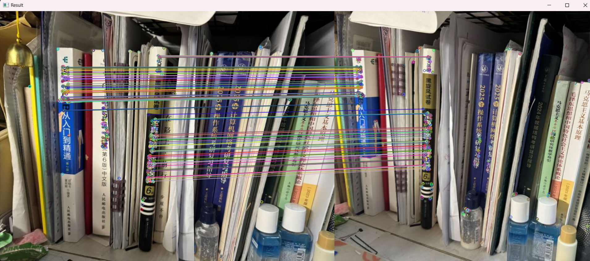

# Homework 1

同济大学 2022级 计算机科学与技术学院 软件工程专业 机器智能方向 计算机视觉课程作业

授课教师：张林

授课学期：2024-2025年度 秋季学期

2251730 刘淑仪

## 证明矩阵集合 \(\{M_i\}\) 构成群

要证明矩阵集合 \(\{M_i\}\) 构成一个群，需要依次证明它满足群的四个性质：**封闭性**、**结合性**、**单位元的存在性**、以及**逆元素的存在性**。具体步骤如下：

### 1. 封闭性
封闭性要求：对于任意两个矩阵 \(M_i\) 和 \(M_j\)，它们的乘积 \(M_i M_j\) 仍然属于集合 \(\{M_i\}\)。

假设 \( M_i \) 和 \( M_j \) 是形式为：
\[
M_i = \begin{bmatrix} R_i & t_i \\ 0^T & 1 \end{bmatrix}, \quad
M_j = \begin{bmatrix} R_j & t_j \\ 0^T & 1 \end{bmatrix}
\]

我们计算矩阵乘积 \( M_i M_j \)：
\[M_i M_j = \begin{bmatrix} R_i & t_i \\ 0^T & 1 \end{bmatrix} \begin{bmatrix} R_j & t_j \\ 0^T & 1 \end{bmatrix} = \begin{bmatrix} R_i R_j & R_i t_j + t_i \\ 0^T & 1 \end{bmatrix}
\]
可以看出，乘积矩阵仍然具有相同的形式，即左上角是 \(R_i R_j\)。
\( R_i \) 和 \( R_j \) 都是正交矩阵，即：
\[
R_i^T R_i = I, \quad R_j^T R_j = I
\]

我们需要证明 \( R_i R_j \) 也是正交矩阵，即 \( (R_i R_j)^T (R_i R_j) = I \)。

首先计算 \( (R_i R_j)^T \)：
\[
(R_i R_j)^T = R_j^T R_i^T
\]

然后计算 \( (R_i R_j)^T (R_i R_j) \)：
\[
(R_i R_j)^T (R_i R_j) = R_j^T R_i^T R_i R_j
\]

由于 \( R_i \) 和 \( R_j \) 是正交矩阵，有 \( R_i^T R_i = I \) 和 \( R_j^T R_j = I \)，因此可以化简为：
\[
R_j^T (R_i^T R_i) R_j = R_j^T I R_j = R_j^T R_j = I
\]

这表明 \( (R_i R_j)^T (R_i R_j) = I \)，因此 \( R_i R_j \) 也是正交矩阵。

右上角是 \(R_i t_j + t_i\)（一个向量），最后一行是 \([0^T, 1]\)。因此，乘积矩阵 \( M_i M_j \) 仍属于集合 \(\{M_i\}\)，说明封闭性成立。

### 2. 结合性
结合性要求：对于任意三个矩阵 \( M_i, M_j, M_k \)，有 \( (M_i M_j) M_k = M_i (M_j M_k) \)。

选择来自\(\{M_i\}\)的任意三个矩阵 \( M_i\), \( M_j \) 和 \( M_k \)，我们有：

\[
(M_i \times M_j) \times M_k = \left(\begin{bmatrix} R_i & t_i \\ 0^T & 1 \end{bmatrix} \begin{bmatrix} R_j & t_j \\ 0^T & 1 \end{bmatrix}\right) \begin{bmatrix} R_k & t_k \\ 0^T & 1 \end{bmatrix}
\]

\[
= \begin{bmatrix} R_i R_j & R_i t_j + t_i \\ 0^T & 1 \end{bmatrix} \begin{bmatrix} R_k & t_k \\ 0^T & 1 \end{bmatrix} = \begin{bmatrix} R_i R_j R_k & R_i R_j t_k + R_i t_j + t_i \\ 0^T & 1 \end{bmatrix}
\]

\[
M_i \times (M_j \times M_k) = \begin{bmatrix} R_i & t_i \\ 0^T & 1 \end{bmatrix} \left(\begin{bmatrix} R_j & t_j \\ 0^T & 1 \end{bmatrix} \begin{bmatrix} R_k & t_k \\ 0^T & 1 \end{bmatrix}\right)
\]

\[
= \begin{bmatrix} R_i & t_i \\ 0^T & 1 \end{bmatrix} \begin{bmatrix} R_j R_k & R_j t_k + t_j \\ 0^T & 1 \end{bmatrix} = \begin{bmatrix} R_i R_j R_k & R_i R_j t_k + R_i t_j + t_i \\ 0^T & 1 \end{bmatrix}
\]

因此：

\[
(M_i \times M_j) \times M_k = M_i \times (M_j \times M_k)
\]

而且矩阵乘法本身是满足结合律的（即 \( (AB)C = A(BC) \) 对任意矩阵成立），所以 \( M_i, M_j, M_k \) 的乘法满足结合律。这表明结合性成立。

### 3. 单位元
单位元要求：存在一个矩阵 \( M_e \in \{M_i\} \)，使得对于任意矩阵 \( M_i \)，有 \( M_e M_i = M_i M_e = M_i \)。

选择单位矩阵：
\[M_e = \begin{bmatrix} I_{3 \times 3} & 0 \\ 0^T & 1 \end{bmatrix}
\]
其中 \(I_3\) 是 \(3 × 3\) 的单位矩阵，0 是 \(3 × 1\) 的零向量。

验证：
\[M_e M_i = \begin{bmatrix} I_{3 \times 3} & 0 \\ 0^T & 1 \end{bmatrix} \begin{bmatrix} R_i & t_i \\ 0^T & 1 \end{bmatrix} = \begin{bmatrix} R_i & t_i \\ 0^T & 1 \end{bmatrix} = M_i
\]
同样地：
\[M_i M_e = \begin{bmatrix} R_i & t_i \\ 0^T & 1 \end{bmatrix} \begin{bmatrix} I_{3 \times 3} & 0 \\ 0^T & 1 \end{bmatrix}  = \begin{bmatrix} R_i & t_i \\ 0^T & 1 \end{bmatrix} = M_i
\]
因此 \( M_e \) 是单位元，单位元存在性成立。

### 4. 逆元素
逆元素要求：对于每一个矩阵 \( M_i \)，存在一个矩阵 \( M_i^{-1} \)，使得 \( M_i M_i^{-1} = M_i^{-1} M_i = M_e \)。

我们来构造矩阵 \( M_i \) 的逆矩阵：
\[M_i^{-1} = \begin{bmatrix} R_i^T & -R_i^T t_i \\ 0^T & 1 \end{bmatrix}
\]
验证：
\[M_i M_i^{-1} = \begin{bmatrix} R_i & t_i \\ 0^T & 1 \end{bmatrix} \begin{bmatrix} R_i^T & -R_i^T t_i \\ 0^T & 1 \end{bmatrix} = \begin{bmatrix} R_i R_i^T & R_i (-R_i^T t_i) + t_i \\ 0^T & 1 \end{bmatrix} = \begin{bmatrix} I_3 & 0 \\ 0^T & 1 \end{bmatrix} = M_e
\]
可以看出 \( M_i^{-1} \) 是 \( M_i \) 的逆矩阵，逆元素存在性成立。

### 总结
通过证明封闭性、结合性、单位元存在性和逆元素存在性，得出 \(\{M_i\}\) 确实构成一个群。

## Harris角点检测器的矩阵性质

### 1. 证明矩阵 \( M \) 是半正定矩阵

首先，矩阵 \( M \) 是对称矩阵，表示为：

\[
M = \begin{bmatrix} 
\sum_{(x_i, y_i) \in w} (I_x)^2 & \sum_{(x_i, y_i) \in w} (I_x I_y) \\ 
\sum_{(x_i, y_i) \in w} (I_x I_y) & \sum_{(x_i, y_i) \in w} (I_y)^2 
\end{bmatrix}
\]

要证明 \( M \) 是半正定矩阵，我们需要验证对于任意向量 \( v = \begin{bmatrix} v_x \\ v_y \end{bmatrix} \)，有：

\[
v^T M v \geq 0
\]

代入具体表达式，展开后为：

\[
v^T M v = v_x^2 \sum (I_x)^2 + 2 v_x v_y \sum (I_x I_y) + v_y^2 \sum (I_y)^2
\]

这个表达式是关于图像局部梯度平方和乘积的二次型。由于图像中的梯度 \( I_x \) 和 \( I_y \) 是实数，且平方和和乘积都是非负的，因此这个二次型的结果总是非负的。

因此，对于任意向量 \( v \)，都有 \( v^T M v \geq 0 \)，证明了矩阵 \( M \) 是半正定矩阵。

### 2. \( M \) 是正定矩阵时，方程 \( [x, y] M \begin{bmatrix} x \\ y \end{bmatrix} = 1 \) 表示椭圆

如果矩阵 \( M \) 是正定矩阵，那么它可以通过特征分解表示为：

\[
M = Q \Lambda Q^T
\]

其中 \( Q \) 是正交矩阵， \( \Lambda \) 是对角矩阵，包含 \( M \) 的两个正特征值 \( \lambda_1 \) 和 \( \lambda_2 \)。

代入原方程：

\[
[x, y] M \begin{bmatrix} x \\ y \end{bmatrix} = 1
\]

得到：

\[
[x', y'] \Lambda \begin{bmatrix} x' \\ y' \end{bmatrix} = 1
\]

其中 \( \begin{bmatrix} x' \\ y' \end{bmatrix} = Q^T \begin{bmatrix} x \\ y \end{bmatrix} \) 表示坐标旋转。

展开为：

\[
\lambda_1 (x')^2 + \lambda_2 (y')^2 = 1
\]

这是椭圆的标准方程，因此该方程表示一个椭圆。

### 3. 椭圆的长轴和短轴长度

我们已经得到椭圆的标准方程：

\[
\lambda_1 (x')^2 + \lambda_2 (y')^2 = 1
\]

根据椭圆的几何性质，长轴和短轴的长度与特征值 \( \lambda_1 \) 和 \( \lambda_2 \) 成反比。因此：

- 长轴对应较小的特征值 \( \lambda_2 \)，其长度为 \( \frac{1}{\sqrt{\lambda_2}} \)。
- 短轴对应较大的特征值 \( \lambda_1 \)，其长度为 \( \frac{1}{\sqrt{\lambda_1}} \)。

得证。

## 证明 \(A^T A\) 非奇异性

要证明 \( A^T A \) 是非奇异的（可逆的），可以通过以下几个步骤来进行分析：

### 1. 矩阵 \( A^T A \) 是对称矩阵
首先，注意到 \( A^T A \) 是一个对称矩阵。因为对于任何矩阵 \( A \)，有：
\[
(A^T A)^T = A^T (A^T)^T = A^T A
\]
所以 \( A^T A \) 是对称的。

### 2. 矩阵 \( A^T A \) 的秩与矩阵 \( A \) 的秩
\( A^T A \) 的秩与 \( A \) 的秩是相同的。因为 \( A^T A \) 的秩与矩阵 \( A \) 的列向量是否线性无关直接相关。已知 \({rank}(A) = n \)，即 \( A \) 的列向量是线性无关的。

- 如果 \( A \) 的列向量线性无关，那么 \( A^T A \) 的秩也是 \( n \)，因此 \( A^T A \) 是满秩矩阵。
- 对于一个 \( n × n \) 的方阵，如果它是满秩的，那么它是可逆的。

### 3. 证明 \( A^T A \) 是正定的
我们可以通过证明 \( A^T A \) 是正定矩阵来得出它是可逆的。

对于任意非零向量 \( x \in \mathbb{R}^n \)，我们考察 \( x^T A^T A x \)：
\[
x^T A^T A x = (A x)^T (A x) = \| A x \|^2
\]
其中，\( \| A x \|^2 \) 表示 \( A x \) 的二范数的平方。

由于 \( A \) 的列向量线性无关，且 \( A \in \mathbb{R}^{m×n} \)（其中 \( m > n \)，且 \( {rank}(A) = n \)），那么对于任意 \( x ≠ 0 \)，\( A x ≠ 0 \)。因此：
\[
\| A x \|^2 > 0 \quad 	{对于任意} \, x ≠ 0 \]
这意味着 \( x^T A^T A x > 0 \) 对于任意非零向量 \( x \)，即 \( A^T A \) 是正定的。

### 4. 正定矩阵是可逆的
由于 \( A^T A \) 是正定的，所以 \( A^T A \) 是非奇异矩阵（可逆矩阵）。

因此，\( A^T A \) 是非奇异矩阵，也就是可逆的。

## 使用 RANSAC 拟合二维直线

在MatLab中，可以使用内置的 `fit` 函数结合 RANSAC 算法来拟合直线，并通过图形化显示拟合结果。

Environment: Windows 11

Platform: MatLab 2023b

Libraries: Base Numeric Functions, Plotting Functions

Code location: ../Program/Prog4.m

### Results are as follows: 

#### 最终结果

## 基于LoG（或DoG）和SIFT的图像拼接

Environment: Windows 11

Platform: PyCharm Professional 2024.1.4

Python version: 3.12.4

Python libraries: numpy opencv-Python

Code location: ../Program/Prog5.py

### Results are as follows:

#### 原始图片

    
    

#### 关键点检测

    
    

#### 匹配结果

#### 拼接结果

## 基于OpenCV的ORB特征点检测与匹配算法实现

Environment: Windows 11

Platform: Visual Studio 2022

Libraries: opencv 4.10.0

Code location: ./Program/Prog6

### Results are as follows:

#### 原始图片

    
    

#### 匹配结果
