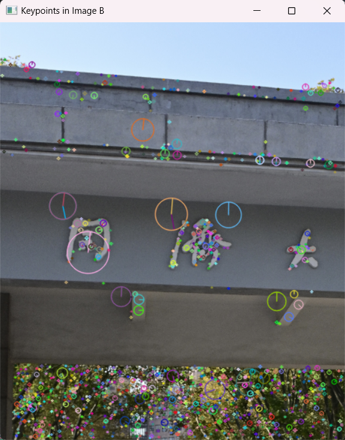
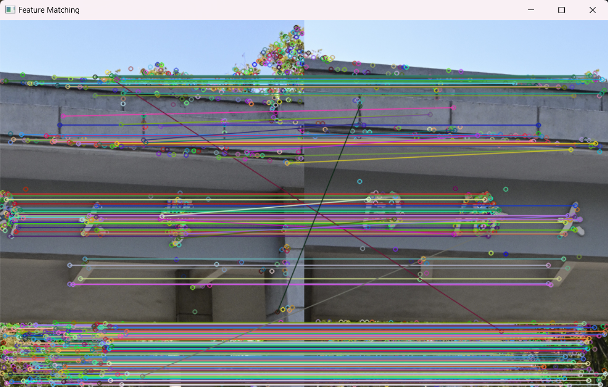

# Homework 2

同济大学 2022级 计算机科学与技术学院 软件工程专业 机器智能方向 计算机视觉课程作业

授课教师：张林

授课学期：2024-2025年度 秋季学期

2251730 刘淑仪

## 无穷远点的齐次坐标

### 1. 封闭性

## 畸变映射的雅可比矩阵

### 1. 证明矩阵 \( M \) 是半正定矩阵

## 旋转矩阵的雅可比矩阵

## 鸟瞰图生成

Environment: Windows 11

Platform: PyCharm Professional 2024.1.4

Python version: 3.12.4

Python libraries: numpy opencv-Python

Code location: ../Program/Prog5.py

### Results are as follows:

#### 原始图片

    
    

#### 关键点检测

    
    

#### 匹配结果

#### 拼接结果
