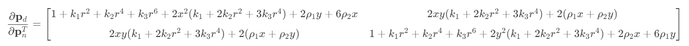
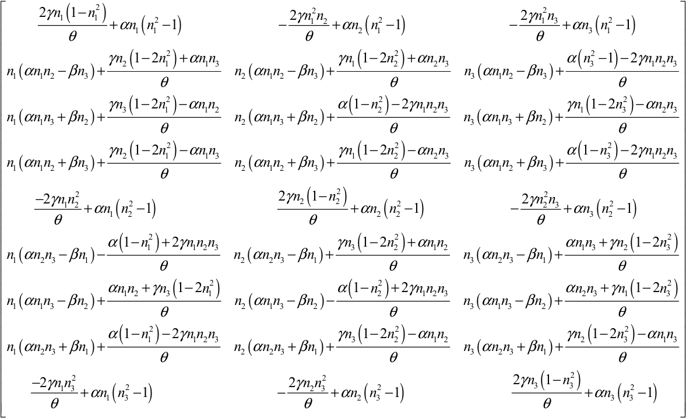

# Homework 2

Tongji University 2022 Class Computer Science and Technology College Software Engineering Major Machine Intelligence Direction Computer Vision Course Assignment

Instructor: Zhang Lin

Semester: 2024-2025 Fall Semester

Student ID: 2251730 Liu Shuyi

## Homogeneous Coordinates of the Point at Infinity

In the extended Euclidean plane (which can be regarded as a projective plane), points are represented by homogeneous coordinates $(X, Y, Z)$, and lines are described by homogeneous equations of the form $aX + bY + cZ = 0$.

Consider the affine line $x - 3y + 4 = 0$. By introducing the homogeneous coordinate $Z$, it can be converted into its homogeneous form:

$$
X - 3Y + 4Z = 0
$$

### Point at Infinity

Points at infinity lie on the line at infinity defined by $Z = 0$. To find the point at infinity corresponding to the given line, substitute $Z = 0$ into the homogeneous equation:

$$
X - 3Y = 0
$$

This simplifies to:

$$
X = 3Y
$$

Therefore, the point at infinity must satisfy $X = 3Y$ and $Z = 0$. Introducing a nonzero constant $k$, the homogeneous coordinates can be represented as:

$$
(3k, k, 0)
$$

where $k \neq 0$. Since homogeneous coordinates are equivalent up to a nonzero scalar multiple, any nonzero scalar $k$ represents the same projective point at infinity.

### Final Answer

The homogeneous coordinates of the point at infinity can be expressed as:

$$
(3k, k, 0) \quad \text{with} \quad k \neq 0
$$

## Jacobian Matrix of Distortion Mapping

Below is the detailed derivation of the Jacobian matrix $\frac{\partial \mathbf{p}_d}{\partial \mathbf{p}_n^T}$ for the mapping from $\mathbf{p}_n = (x, y)^T$ to $\mathbf{p}_d = (x_d, y_d)^T$.

Given:

$$
x_d = x(1 + k_1 r^2 + k_2 r^4 + k_3 r^6) + 2\rho_1 x y + \rho_2(r^2 + 2x^2)
$$

$$
y_d = y(1 + k_1 r^2 + k_2 r^4 + k_3 r^6) + 2\rho_2 x y + \rho_1(r^2 + 2y^2)
$$

where $r^2 = x^2 + y^2$.

Define:

$$
A = 1 + k_1 r^2 + k_2 r^4 + k_3 r^6
$$

Thus:

$$
x_d = xA + 2\rho_1 x y + \rho_2(r^2 + 2x^2)
$$

$$
y_d = yA + 2\rho_2 x y + \rho_1(r^2 + 2y^2)
$$

We need to calculate:

$$
\frac{\partial \mathbf{p}_d}{\partial \mathbf{p}_n^T} =
\begin{bmatrix}
\frac{\partial x_d}{\partial x} & \frac{\partial x_d}{\partial y} \\[6pt]
\frac{\partial y_d}{\partial x} & \frac{\partial y_d}{\partial y}
\end{bmatrix}
$$

### Calculate $\frac{\partial x_d}{\partial x}$

First, calculate $\frac{\partial A}{\partial x}$:

$$
\frac{\partial A}{\partial x} = 2x(k_1 + 2k_2 r^2 + 3k_3 r^4)
$$

Then:

$$
\frac{\partial x_d}{\partial x} = A + x\frac{\partial A}{\partial x} + 2\rho_1 y + \frac{\partial}{\partial x}[\rho_2(r^2 + 2x^2)]
= A + 2x^2(k_1 + 2k_2 r^2 + 3k_3 r^4) + 2\rho_1 y + 6\rho_2 x
$$

Substituting $A$:

$$
\frac{\partial x_d}{\partial x} = (1 + k_1 r^2 + k_2 r^4 + k_3 r^6) + 2x^2(k_1 + 2k_2 r^2 + 3k_3 r^4) + 2\rho_1 y + 6\rho_2 x
$$

### Calculate $\frac{\partial x_d}{\partial y}$

First, calculate $\frac{\partial A}{\partial y}$:

$$
\frac{\partial A}{\partial y} = 2y(k_1 + 2k_2 r^2 + 3k_3 r^4)
$$

Then:

$$
\frac{\partial x_d}{\partial y} = x\frac{\partial A}{\partial y} + 2\rho_1 x + \frac{\partial}{\partial y}[\rho_2(r^2 + 2x^2)]
= 2xy(k_1 + 2k_2 r^2 + 3k_3 r^4) + 2\rho_1 x + 2\rho_2 y
$$

### Calculate $\frac{\partial y_d}{\partial x}$

$$
\frac{\partial y_d}{\partial x} = y\frac{\partial A}{\partial x} + 2\rho_2 y + \rho_1(2x)
= 2xy(k_1 + 2k_2 r^2 + 3k_3 r^4) + 2\rho_2 y + 2\rho_1 x
$$

### Calculate $\frac{\partial y_d}{\partial y}$

$$
\frac{\partial y_d}{\partial y} = A + y\frac{\partial A}{\partial y} + 2\rho_2 x + \frac{\partial}{\partial y}[\rho_1(r^2 + 2y^2)]
= A + 2y^2(k_1 + 2k_2 r^2 + 3k_3 r^4) + 2\rho_2 x + 6\rho_1 y
$$

Substituting $A$:

$$
\frac{\partial y_d}{\partial y} = (1 + k_1 r^2 + k_2 r^4 + k_3 r^6) + 2y^2(k_1 + 2k_2 r^2 + 3k_3 r^4) + 2\rho_2 x + 6\rho_1 y
$$

### Final Jacobian Matrix

Combining the above results, we have:

## Jacobian Matrix of Rotation Matrix

### Rodrigues' Rotation Formula

Given the axis-angle representation \( \mathbf{d} = \theta \mathbf{n} \), where \( \theta \) is the rotation angle and \( \mathbf{n} \) is the unit rotation axis, the rotation matrix \( R \) can be expressed using Rodrigues' rotation formula:

$$
R = \cos\theta \, I + (1 - \cos\theta) \, \mathbf{n}\mathbf{n}^T + \sin\theta \, \mathbf{n}^\wedge
$$

where:
- \( I \) is the \( 3 \times 3 \) identity matrix.
- \( \mathbf{n}^\wedge \) is the skew-symmetric matrix of \( \mathbf{n} \):

  $$
  \mathbf{n}^\wedge = \begin{bmatrix}
  0 & -n_3 & n_2 \\
  n_3 & 0 & -n_1 \\
  -n_2 & n_1 & 0
  \end{bmatrix}
  $$

- \( \alpha = \sin\theta \)
- \( \beta = \cos\theta \)
- \( \gamma = 1 - \cos\theta \)

Substituting these notations, the rotation matrix simplifies to:

$$
R = \beta I + \gamma \mathbf{n}\mathbf{n}^T + \alpha \mathbf{n}^\wedge
$$

### Vectorizing the Rotation Matrix

The rotation matrix \( R \) is a \( 3 \times 3 \) matrix. To facilitate differentiation, we vectorize \( R \) into a \( 9 \times 1 \) vector \( \mathbf{r} \) in row-major order:

$$
\mathbf{r} = \begin{bmatrix}
r_{11} & r_{12} & r_{13} & r_{21} & r_{22} & r_{23} & r_{31} & r_{32} & r_{33}
\end{bmatrix}^T
$$

### Detailed Calculation of \( \mathbf{r} \)

Expanding \( R \) using Rodrigues' formula:

$$
R = \beta I + \gamma \mathbf{n}\mathbf{n}^T + \alpha \mathbf{n}^\wedge
$$

Breaking it down element-wise, we obtain:

$$
R = \begin{bmatrix}
\beta + \gamma n_1^2 & \gamma n_1 n_2 - \alpha n_3 & \gamma n_1 n_3 + \alpha n_2 \\
\gamma n_2 n_1 + \alpha n_3 & \beta + \gamma n_2^2 & \gamma n_2 n_3 - \alpha n_1 \\
\gamma n_3 n_1 - \alpha n_2 & \gamma n_3 n_2 + \alpha n_1 & \beta + \gamma n_3^2
\end{bmatrix}
$$

Vectorizing \( R \):

$$
\mathbf{r} = \begin{bmatrix}
\beta + \gamma n_1^2 \\
\gamma n_1 n_2 - \alpha n_3 \\
\gamma n_1 n_3 + \alpha n_2 \\
\gamma n_2 n_1 + \alpha n_3 \\
\beta + \gamma n_2^2 \\
\gamma n_2 n_3 - \alpha n_1 \\
\gamma n_3 n_1 - \alpha n_2 \\
\gamma n_3 n_2 + \alpha n_1 \\
\beta + \gamma n_3^2
\end{bmatrix}
$$

### Calculating the Jacobian \( \frac{d\mathbf{r}}{d\mathbf{n}^T} \)

The Jacobian matrix \( \frac{d\mathbf{r}}{d\mathbf{n}^T} \) is a \( 9 \times 3 \) matrix where each element \( \frac{\partial r_i}{\partial n_j} \) represents the partial derivative of the \( i \)-th component of \( \mathbf{r} \) with respect to the \( j \)-th component of \( \mathbf{n} \).

#### Partial Derivatives

1. **First Component \( r_1 = \beta + \gamma n_1^2 \)**

   $$
   \frac{\partial r_1}{\partial \mathbf{n}} = \begin{bmatrix}
   2\gamma n_1 \\
   0 \\
   0
   \end{bmatrix}
   $$

2. **Second Component \( r_2 = \gamma n_1 n_2 - \alpha n_3 \)**

   $$
   \frac{\partial r_2}{\partial \mathbf{n}} = \begin{bmatrix}
   \gamma n_2 \\
   \gamma n_1 \\
   -\alpha
   \end{bmatrix}
   $$

3. **Third Component \( r_3 = \gamma n_1 n_3 + \alpha n_2 \)**

   $$
   \frac{\partial r_3}{\partial \mathbf{n}} = \begin{bmatrix}
   \gamma n_3 \\
   \alpha \\
   \gamma n_1
   \end{bmatrix}
   $$

4. **Fourth Component \( r_4 = \gamma n_2 n_1 + \alpha n_3 \)**

   $$
   \frac{\partial r_4}{\partial \mathbf{n}} = \begin{bmatrix}
   \gamma n_2 \\
   \gamma n_1 \\
   \alpha
   \end{bmatrix}
   $$

5. **Fifth Component \( r_5 = \beta + \gamma n_2^2 \)**

   $$
   \frac{\partial r_5}{\partial \mathbf{n}} = \begin{bmatrix}
   0 \\
   2\gamma n_2 \\
   0
   \end{bmatrix}
   $$

6. **Sixth Component \( r_6 = \gamma n_2 n_3 - \alpha n_1 \)**

   $$
   \frac{\partial r_6}{\partial \mathbf{n}} = \begin{bmatrix}
   -\alpha \\
   \gamma n_3 \\
   \gamma n_2
   \end{bmatrix}
   $$

7. **Seventh Component \( r_7 = \gamma n_3 n_1 - \alpha n_2 \)**

   $$
   \frac{\partial r_7}{\partial \mathbf{n}} = \begin{bmatrix}
   \gamma n_3 \\
   -\alpha \\
   \gamma n_1
   \end{bmatrix}
   $$

8. **Eighth Component \( r_8 = \gamma n_3 n_2 + \alpha n_1 \)**

   $$
   \frac{\partial r_8}{\partial \mathbf{n}} = \begin{bmatrix}
   \alpha \\
   \gamma n_3 \\
   \gamma n_2
   \end{bmatrix}
   $$

9. **Ninth Component \( r_9 = \beta + \gamma n_3^2 \)**

   $$
   \frac{\partial r_9}{\partial \mathbf{n}} = \begin{bmatrix}
   0 \\
   0 \\
   2\gamma n_3
   \end{bmatrix}
   $$

#### Assembling the Jacobian Matrix

Combining all the partial derivatives, the Jacobian matrix \( \frac{d\mathbf{r}}{d\mathbf{n}^T} \) is:

$$
\frac{d\mathbf{r}}{d\mathbf{n}^T} =
\begin{bmatrix}
2\gamma n_1 & 0 & 0 \\
\gamma n_2 & \gamma n_1 & -\alpha \\
\gamma n_3 & \alpha & \gamma n_1 \\
\gamma n_2 & \gamma n_1 & \alpha \\
0 & 2\gamma n_2 & 0 \\
-\alpha & \gamma n_3 & \gamma n_2 \\
\gamma n_3 & -\alpha & \gamma n_1 \\
\alpha & \gamma n_3 & \gamma n_2 \\
0 & 0 & 2\gamma n_3 \\
\end{bmatrix}
$$

### Calculating the Jacobian Matrix of \( \mathbf{r} \) with Respect to \( \mathbf{d} \) (\( \frac{\partial \mathbf{r}}{\partial \mathbf{d}^T} \))

Using the chain rule, the Jacobian matrix \( \frac{\partial \mathbf{r}}{\partial \mathbf{d}^T} \) can be expressed as:

$$
\frac{\partial \mathbf{r}}{\partial \mathbf{d}^T} = \frac{\partial \mathbf{r}}{\partial \theta} \frac{\partial \theta}{\partial \mathbf{d}^T} + \frac{\partial \mathbf{r}}{\partial \mathbf{n}^T} \frac{\partial \mathbf{n}}{\partial \mathbf{d}^T}
$$

#### 1. Calculate \( \frac{\partial \theta}{\partial \mathbf{d}^T} \)

Given \( \theta = \|\mathbf{d}\| = \sqrt{d_1^2 + d_2^2 + d_3^2} \), the partial derivative of \( \theta \) with respect to \( \mathbf{d} \) is:

$$
\frac{\partial \theta}{\partial \mathbf{d}^T} = \frac{\mathbf{d}^T}{\theta} = \mathbf{n}^T
$$

#### 2. Calculate \( \frac{\partial \mathbf{n}}{\partial \mathbf{d}^T} \)

Since \( \mathbf{n} = \frac{\mathbf{d}}{\theta} \), differentiating with respect to \( \mathbf{d}^T \) yields:

$$
\frac{\partial \mathbf{n}}{\partial \mathbf{d}^T} = \frac{1}{\theta} \left( I - \mathbf{n}\mathbf{n}^T \right)
$$

where \( I \) is the \( 3 \times 3 \) identity matrix.

#### 3. Calculate \( \frac{\partial \mathbf{r}}{\partial \theta} \)

From the expression of \( \mathbf{r} \):

$$
\mathbf{r} = \begin{bmatrix}
\beta + \gamma n_1^2 \\
\gamma n_1 n_2 - \alpha n_3 \\
\gamma n_1 n_3 + \alpha n_2 \\
\gamma n_2 n_1 + \alpha n_3 \\
\beta + \gamma n_2^2 \\
\gamma n_2 n_3 - \alpha n_1 \\
\gamma n_3 n_1 - \alpha n_2 \\
\gamma n_3 n_2 + \alpha n_1 \\
\beta + \gamma n_3^2
\end{bmatrix}
$$

Taking the derivative with respect to \( \theta \):

- \( \frac{\partial \beta}{\partial \theta} = -\sin\theta = -\alpha \)
- \( \frac{\partial \gamma}{\partial \theta} = \sin\theta = \alpha \)

Thus, the derivative \( \frac{\partial \mathbf{r}}{\partial \theta} \) is:

$$
\frac{\partial \mathbf{r}}{\partial \theta} = \begin{bmatrix}
-\alpha + \alpha n_1^2 \\
\alpha n_1 n_2 - \cos\theta n_3 \\
\alpha n_1 n_3 + \cos\theta n_2 \\
\alpha n_2 n_1 + \cos\theta n_3 \\
-\alpha + \alpha n_2^2 \\
\alpha n_2 n_3 - \cos\theta n_1 \\
\alpha n_3 n_1 - \cos\theta n_2 \\
\alpha n_3 n_2 + \cos\theta n_1 \\
-\alpha + \alpha n_3^2 \\
\end{bmatrix}
$$

However, for simplification, if higher-order derivatives are negligible or specific assumptions are made, this term can be adjusted accordingly.

#### 4. Substitute into the Chain Rule

Combining the above results, the Jacobian \( \frac{\partial \mathbf{r}}{\partial \mathbf{d}^T} \) becomes:

$$
\frac{\partial \mathbf{r}}{\partial \mathbf{d}^T} = \frac{\partial \mathbf{r}}{\partial \theta} \mathbf{n}^T + \frac{1}{\theta} \frac{\partial \mathbf{r}}{\partial \mathbf{n}^T} \left( I - \mathbf{n}\mathbf{n}^T \right)
$$

### Final Answer

The concrete form of the Jacobian matrix is:

## Bird's Eye View Generation

Environment: Windows 11

Platform: PyCharm Professional 2024.1.4

Python version: 3.12.4

Python libraries: numpy opencv-Python

### Results are as follows:

#### Camera calibration parameters

##### Reprojection Error
$ret = 1.3526290383110415$

##### Intrinsic Matrix
$\text{mtx} = \begin{bmatrix}
1.06408820 \times 10^3 & 0.00000000 \times 10^0 & 6.97624043 \times 10^2 \\
0.00000000 \times 10^0 & 1.05884544 \times 10^3 & 3.67820618 \times 10^2 \\
0.00000000 \times 10^0 & 0.00000000 \times 10^0 & 1.00000000 \times 10^0
\end{bmatrix}$

##### Distortion Coefficients
$\text{dist} = \begin{bmatrix}
2.19183009 \times 10^{-1} & -9.71999184 \times 10^{-1} & 8.92226849 \times 10^{-4} & -7.72790370 \times 10^{-3} & 9.61389806 \times 10^{-1}
\end{bmatrix}$

##### Rotation Vectors
$\text{rvecs} = \begin{pmatrix}
\begin{bmatrix}
-0.15060814 \\
0.68259582 \\
-1.42548071
\end{bmatrix}, &
\begin{bmatrix}
-0.62169292 \\
0.02379807 \\
-1.54327886
\end{bmatrix}, &
\begin{bmatrix}
-0.48797313 \\
0.57757602 \\
-1.47210871
\end{bmatrix}, &
\begin{bmatrix}
-0.00730448 \\
0.19318482 \\
-1.58085337
\end{bmatrix}, &
\begin{bmatrix}
0.42666152 \\
0.16677968 \\
-1.6343885
\end{bmatrix}, \\
\begin{bmatrix}
0.42971655 \\
-0.20436555 \\
-1.63009947
\end{bmatrix}, &
\begin{bmatrix}
0.12150479 \\
-0.42919655 \\
-1.65266561
\end{bmatrix}, &
\begin{bmatrix}
-0.29258934 \\
-0.22613081 \\
-1.57129171
\end{bmatrix}, &
\begin{bmatrix}
-0.38838256 \\
0.73023776 \\
-1.34886676
\end{bmatrix}, &
\begin{bmatrix}
0.47889099 \\
-0.40162315 \\
-1.70266642
\end{bmatrix}
\end{pmatrix}$

##### Translation Vectors
$\text{tvecs} = \begin{pmatrix}
\begin{bmatrix}
-0.16131816 \\
0.04315679 \\
0.4099573
\end{bmatrix}, &
\begin{bmatrix}
-0.1625625 \\
0.07084516 \\
0.35582155
\end{bmatrix}, &
\begin{bmatrix}
-0.17356461 \\
0.05434441 \\
0.38696302
\end{bmatrix}, &
\begin{bmatrix}
-0.13625178 \\
0.07758926 \\
0.37540559
\end{bmatrix}, &
\begin{bmatrix}
-0.08562375 \\
0.08729008 \\
0.34406331
\end{bmatrix}, \\
\begin{bmatrix}
-0.05401651 \\
0.05972098 \\
0.28404526
\end{bmatrix}, &
\begin{bmatrix}
-0.07216266 \\
0.05521112 \\
0.27942144
\end{bmatrix}, &
\begin{bmatrix}
-0.12059918 \\
0.061236 \\
0.32392025
\end{bmatrix}, &
\begin{bmatrix}
-0.18402187 \\
0.03017638 \\
0.39936983
\end{bmatrix}, &
\begin{bmatrix}
-0.04641674 \\
0.05393896 \\
0.27967062
\end{bmatrix}
\end{pmatrix}$

#### Original Image

#### Undistorted Image

#### Bird's Eye View
