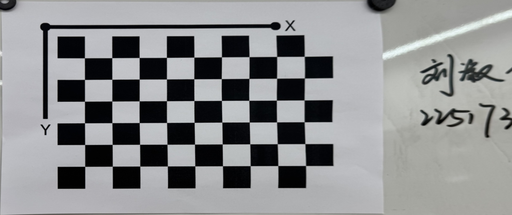

# Homework 2

Tongji University 2022 Class Computer Science and Technology College Software Engineering Major Machine Intelligence Direction Computer Vision Course Assignment

Instructor: Zhang Lin

Semester: 2024-2025 Fall Semester

Student ID: 2251730 Liu Shuyi

## Homogeneous Coordinates of the Point at Infinity

First, convert the line equation into the homogeneous equation form in the projective plane:

\[
X - 3Y + 4Z = 0
\]

The point at infinity satisfies \( Z = 0 \), so substitute \( Z = 0 \) into the equation to get:

\[
X - 3Y = 0 \quad \Rightarrow \quad X = 3Y
\]

Therefore, the homogeneous coordinates of the point at infinity are:

\[
[3Y, Y, 0]^T = [3, 1, 0]^T
\]

In conclusion, the homogeneous coordinates of the point at infinity for the line \( x - 3y + 4 = 0 \) are:

\[
[3, 1, 0]^T
\]

## Jacobian Matrix of Distortion Mapping

In the normalized retinal plane, assume \( p_n \) is an ideal projection point without considering distortion. If distortion is considered,\( p_n = (x, y)^T \) is mapped to \( p_d = (x_d, y_d)^T \), with the relationship represented by the following equations:

\[
\begin{cases}
x_d = x(1 + k_r r^2 + k_y r^4) + 2\rho_1 xy + \rho_2 (r^2 + 2x^2) + x k_r r^6 \\
y_d = y(1 + k_r r^2 + k_y r^4) + 2\rho_2 xy + \rho_1 (r^2 + 2y^2) + y k_r r^6
\end{cases}
\]

where \( r^2 = x^2 + y^2 \)。

To perform nonlinear optimization in the camera calibration process, we need to calculate the Jacobian matrix of \( p_d \) with respect to \( p_n \) 
\[
\frac{dp_d}{dp_n} = \begin{bmatrix}
\frac{\partial x_d}{\partial x} & \frac{\partial x_d}{\partial y} \\
\frac{\partial y_d}{\partial x} & \frac{\partial y_d}{\partial y}
\end{bmatrix}
\]

After detailed derivation, the partial derivatives are as follows:

\[
\frac{\partial x_d}{\partial x} = 1 + k_r r^2 + k_y r^4 + 2 k_r x^2 + 4 k_y r^2 x^2 + 2 \rho_1 y + 6 \rho_2 x + k_r r^6 + 6 k_r x^2 r^4
\]

\[
\frac{\partial x_d}{\partial y} = 2 k_r x y + 4 k_y r^2 x y + 2 \rho_1 x + 2 \rho_2 y + 6 k_r x y r^4
\]

\[
\frac{\partial y_d}{\partial x} = 2 k_r x y + 4 k_y r^2 x y + 2 \rho_2 y + 2 \rho_1 x + 6 k_r x y r^4
\]

\[
\frac{\partial y_d}{\partial y} = 1 + k_r r^2 + k_y r^4 + 2 k_r y^2 + 4 k_y r^2 y^2 + 2 \rho_2 x + 2 \rho_1 y + k_r r^6 + 6 k_r y^2 r^4
\]

Therefore, the Jacobian matrix is:

\[
\frac{dp_d}{dp_n} = \begin{bmatrix}
1 + k_r r^2 + k_y r^4 + 2 k_r x^2 + 4 k_y r^2 x^2 + 2 \rho_1 y + 6 \rho_2 x + k_r r^6 + 6 k_r x^2 r^4 & 2 k_r x y + 4 k_y r^2 x y + 2 \rho_1 x + 2 \rho_2 y + 6 k_r x y r^4 \\
2 k_r x y + 4 k_y r^2 x y + 2 \rho_2 y + 2 \rho_1 x + 6 k_r x y r^4 & 1 + k_r r^2 + k_y r^4 + 2 k_r y^2 + 4 k_y r^2 y^2 + 2 \rho_2 x + 2 \rho_1 y + k_r r^6 + 6 k_r y^2 r^4
\end{bmatrix}
\]

## Jacobian Matrix of Rotation Matrix

### 1. Definition of Rotation Matrix

According to Rodrigues' formula, the rotation matrix \( R \) can be expressed as:

\[
R = \beta I + \gamma n n^T + \alpha [n]_\times
\]

where:
- \( \beta = \cos \theta \)
- \( \gamma = 1 - \cos \theta \)
- \( \alpha = \sin \theta \)
- \( I \) is the identity matrix
- \( [n]_\times \) is the skew-symmetric matrix of \( n \)

### 2. Vectorization of Rotation Matrix

The vectorized form of the rotation matrix \( R \) is：

\[
r = (r_{11}, r_{12}, r_{13}, r_{21}, r_{22}, r_{23}, r_{31}, r_{32}, r_{33})^T
\]

### 3. Calculation of Jacobian Matrix

We need to calculate the Jacobian matrix \( \frac{dr}{dd^T} \) of \( r \) with respect to \( d \) , where \( d = \theta n \) and \( n \) is a unit vector.

First, calculate the partial derivatives of \( r_{ij} \) with respect to \( \theta \) and \( n \) , then use the chain rule to find the partial derivatives of \( r_{ij} \) with respect to \( d \).

#### 3.1 Partial Derivatives of \( r_{ij} \) with respect to \( \theta \)

For example:

\[
\frac{\partial r_{11}}{\partial \theta} = -\sin \theta + (1 - \cos \theta) \cdot 2 n_1^2
\]

#### 3.2 Partial Derivatives of \( r_{ij} \) with respect to \( n \)

For example:

\[
\frac{\partial r_{11}}{\partial n_1} = 2 (1 - \cos \theta) n_1
\]

#### 3.3 Partial Derivatives of \( \theta \) and \( n \) with respect to \( d \)

Since \( d = \theta n \) and \( n \) is a unit vector, therefore:

\[
\theta = \|d\|, \quad n = \frac{d}{\|d\|}
\]

So:

\[
\frac{\partial \theta}{\partial d_k} = \frac{d_k}{\theta}
\]

\[
\frac{\partial n_i}{\partial d_k} = \frac{\delta_{ik} \theta - n_k d_i}{\theta^2}
\]

#### 3.4 Combining Partial Derivatives

Using the chain rule, combine the above partial derivatives:

\[
\frac{\partial r_{ij}}{\partial d_k} = \frac{\partial r_{ij}}{\partial \theta} \frac{\partial \theta}{\partial d_k} + \sum_{m=1}^3 \frac{\partial r_{ij}}{\partial n_m} \frac{\partial n_m}{\partial d_k}
\]

#### 4. Conclusion

Through the above steps, we can calculate the partial derivatives of each \( r_{ij} \) with respect to \( d_k \) and finally construct the Jacobian matrix \( \frac{dr}{dd^T} \) . This process requires careful symbolic computation to ensure each step is accurate.

## Bird's Eye View Generation

Environment: Windows 11

Platform: PyCharm Professional 2024.1.4

Python version: 3.12.4

Python libraries: numpy opencv-Python

Code location: ../Project1

### Results are as follows:

#### 相机标定参数

### Reprojection Error
$ret = 1.3526290383110415$

### Intrinsic Matrix
$\text{mtx} = \begin{bmatrix}
1.06408820 \times 10^3 & 0.00000000 \times 10^0 & 6.97624043 \times 10^2 \\
0.00000000 \times 10^0 & 1.05884544 \times 10^3 & 3.67820618 \times 10^2 \\
0.00000000 \times 10^0 & 0.00000000 \times 10^0 & 1.00000000 \times 10^0
\end{bmatrix}$

### Distortion Coefficients
$\text{dist} = \begin{bmatrix}
2.19183009 \times 10^{-1} & -9.71999184 \times 10^{-1} & 8.92226849 \times 10^{-4} & -7.72790370 \times 10^{-3} & 9.61389806 \times 10^{-1}
\end{bmatrix}$

### Rotation Vectors
$\text{rvecs} = \begin{pmatrix}
\begin{bmatrix}
-0.15060814 \\
0.68259582 \\
-1.42548071
\end{bmatrix}, &
\begin{bmatrix}
-0.62169292 \\
0.02379807 \\
-1.54327886
\end{bmatrix}, &
\begin{bmatrix}
-0.48797313 \\
0.57757602 \\
-1.47210871
\end{bmatrix}, &
\begin{bmatrix}
-0.00730448 \\
0.19318482 \\
-1.58085337
\end{bmatrix}, &
\begin{bmatrix}
0.42666152 \\
0.16677968 \\
-1.6343885
\end{bmatrix}, &
\begin{bmatrix}
0.42971655 \\
-0.20436555 \\
-1.63009947
\end{bmatrix}, &
\begin{bmatrix}
0.12150479 \\
-0.42919655 \\
-1.65266561
\end{bmatrix}, &
\begin{bmatrix}
-0.29258934 \\
-0.22613081 \\
-1.57129171
\end{bmatrix}, &
\begin{bmatrix}
-0.38838256 \\
0.73023776 \\
-1.34886676
\end{bmatrix}, &
\begin{bmatrix}
0.47889099 \\
-0.40162315 \\
-1.70266642
\end{bmatrix}
\end{pmatrix}$

### Translation Vectors
$\text{tvecs} = \begin{pmatrix}
\begin{bmatrix}
-0.16131816 \\
0.04315679 \\
0.4099573
\end{bmatrix}, &
\begin{bmatrix}
-0.1625625 \\
0.07084516 \\
0.35582155
\end{bmatrix}, &
\begin{bmatrix}
-0.17356461 \\
0.05434441 \\
0.38696302
\end{bmatrix}, &
\begin{bmatrix}
-0.13625178 \\
0.07758926 \\
0.37540559
\end{bmatrix}, &
\begin{bmatrix}
-0.08562375 \\
0.08729008 \\
0.34406331
\end{bmatrix}, &
\begin{bmatrix}
-0.05401651 \\
0.05972098 \\
0.28404526
\end{bmatrix}, &
\begin{bmatrix}
-0.07216266 \\
0.05521112 \\
0.27942144
\end{bmatrix}, &
\begin{bmatrix}
-0.12059918 \\
0.061236 \\
0.32392025
\end{bmatrix}, &
\begin{bmatrix}
-0.18402187 \\
0.03017638 \\
0.39936983
\end{bmatrix}, &
\begin{bmatrix}
-0.04641674 \\
0.05393896 \\
0.27967062
\end{bmatrix}
\end{pmatrix}$

#### Original Image

#### Undistorted Image

#### Bird's Eye View
