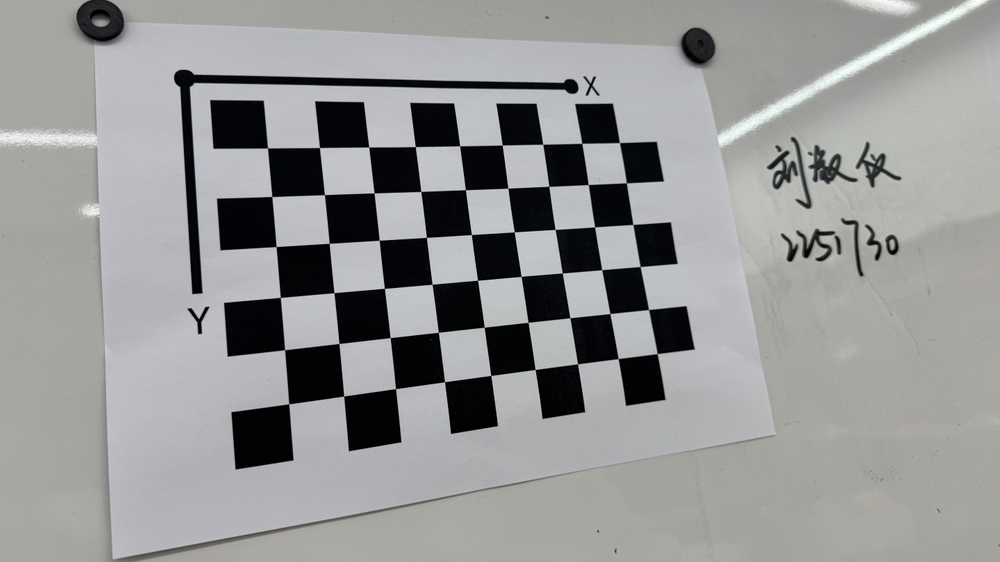
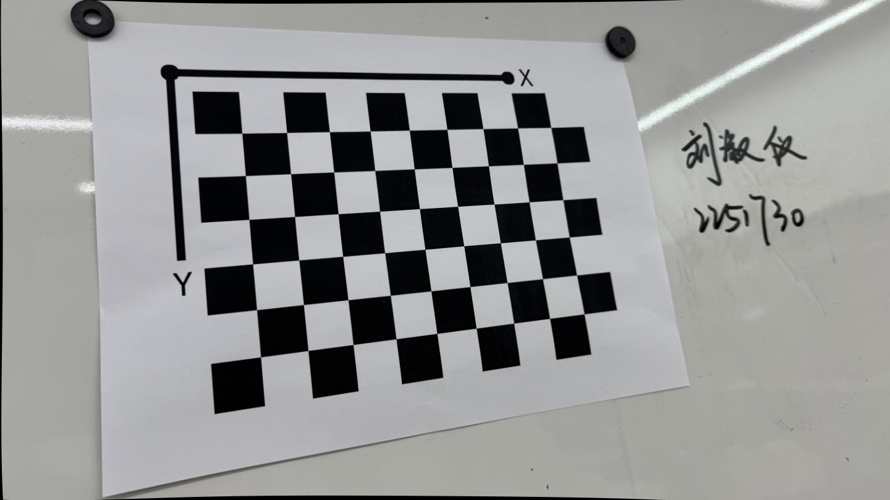
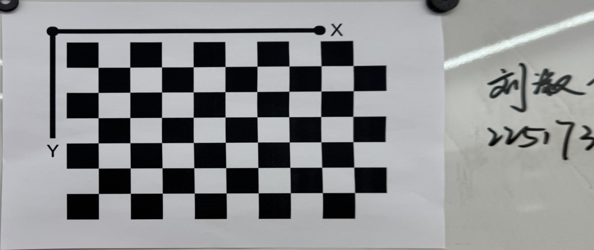

# Homework 2

同济大学 2022级 计算机科学与技术学院 软件工程专业 机器智能方向 计算机视觉课程作业

授课教师：张林

授课学期：2024-2025年度 秋季学期

2251730 刘淑仪

## 无穷远点的齐次坐标

首先，将直线方程转换为射影平面中的齐次方程形式：

\[
X - 3Y + 4Z = 0
\]

无穷远点满足 \( Z = 0 \)，因此将 \( Z = 0 \) 代入方程，得到：

\[
X - 3Y = 0 \quad \Rightarrow \quad X = 3Y
\]

因此，无穷远点的齐次坐标为：

\[
[3Y, Y, 0]^T = [3, 1, 0]^T
\]

综上所述，直线 \( x - 3y + 4 = 0 \) 的无穷远点的齐次坐标是：

\[
[3, 1, 0]^T
\]

## 畸变映射的雅可比矩阵

在归一化视网膜平面上，假设 \( p_n \) 是一个不考虑畸变的理想投影点。如果考虑畸变，\( p_n = (x, y)^T \) 被映射到 \( p_d = (x_d, y_d)^T \)，其关系由以下方程组表示：

\[
\begin{cases}
x_d = x(1 + k_r r^2 + k_y r^4) + 2\rho_1 xy + \rho_2 (r^2 + 2x^2) + x k_r r^6 \\
y_d = y(1 + k_r r^2 + k_y r^4) + 2\rho_2 xy + \rho_1 (r^2 + 2y^2) + y k_r r^6
\end{cases}
\]

其中 \( r^2 = x^2 + y^2 \)。

为了在相机标定的流程中进行非线性优化，我们需要计算 \( p_d \) 对 \( p_n \) 的雅可比矩阵：

\[
\frac{dp_d}{dp_n} = \begin{bmatrix}
\frac{\partial x_d}{\partial x} & \frac{\partial x_d}{\partial y} \\
\frac{\partial y_d}{\partial x} & \frac{\partial y_d}{\partial y}
\end{bmatrix}
\]

经过详细推导，各偏导数如下：

\[
\frac{\partial x_d}{\partial x} = 1 + k_r r^2 + k_y r^4 + 2 k_r x^2 + 4 k_y r^2 x^2 + 2 \rho_1 y + 6 \rho_2 x + k_r r^6 + 6 k_r x^2 r^4
\]

\[
\frac{\partial x_d}{\partial y} = 2 k_r x y + 4 k_y r^2 x y + 2 \rho_1 x + 2 \rho_2 y + 6 k_r x y r^4
\]

\[
\frac{\partial y_d}{\partial x} = 2 k_r x y + 4 k_y r^2 x y + 2 \rho_2 y + 2 \rho_1 x + 6 k_r x y r^4
\]

\[
\frac{\partial y_d}{\partial y} = 1 + k_r r^2 + k_y r^4 + 2 k_r y^2 + 4 k_y r^2 y^2 + 2 \rho_2 x + 2 \rho_1 y + k_r r^6 + 6 k_r y^2 r^4
\]

因此，雅可比矩阵为：

\[
\frac{dp_d}{dp_n} = \begin{bmatrix}
1 + k_r r^2 + k_y r^4 + 2 k_r x^2 + 4 k_y r^2 x^2 + 2 \rho_1 y + 6 \rho_2 x + k_r r^6 + 6 k_r x^2 r^4 & 2 k_r x y + 4 k_y r^2 x y + 2 \rho_1 x + 2 \rho_2 y + 6 k_r x y r^4 \\
2 k_r x y + 4 k_y r^2 x y + 2 \rho_2 y + 2 \rho_1 x + 6 k_r x y r^4 & 1 + k_r r^2 + k_y r^4 + 2 k_r y^2 + 4 k_y r^2 y^2 + 2 \rho_2 x + 2 \rho_1 y + k_r r^6 + 6 k_r y^2 r^4
\end{bmatrix}
\]

## 旋转矩阵的雅可比矩阵

### 1. 旋转矩阵的定义

根据罗德里格斯公式，旋转矩阵 \( R \) 可以表示为：

\[
R = \beta I + \gamma n n^T + \alpha [n]_\times
\]

其中：
- \( \beta = \cos \theta \)
- \( \gamma = 1 - \cos \theta \)
- \( \alpha = \sin \theta \)
- \( I \) 是单位矩阵
- \( [n]_\times \) 是 \( n \) 的反对称矩阵

### 2. 向量化旋转矩阵

旋转矩阵 \( R \) 的向量化形式为：

\[
r = (r_{11}, r_{12}, r_{13}, r_{21}, r_{22}, r_{23}, r_{31}, r_{32}, r_{33})^T
\]

### 3. 雅可比矩阵的计算

我们需要计算 \( r \) 对 \( d \) 的雅可比矩阵 \( \frac{dr}{dd^T} \)，其中 \( d = \theta n \)，且 \( n \) 是单位向量。

首先，计算 \( r_{ij} \) 对 \( \theta \) 和 \( n \) 的偏导数，然后利用链式法则求得 \( r_{ij} \) 对 \( d \) 的偏导数。

#### 3.1 \( r_{ij} \) 对 \( \theta \) 的偏导数

例如：

\[
\frac{\partial r_{11}}{\partial \theta} = -\sin \theta + (1 - \cos \theta) \cdot 2 n_1^2
\]

#### 3.2 \( r_{ij} \) 对 \( n \) 的偏导数

例如：

\[
\frac{\partial r_{11}}{\partial n_1} = 2 (1 - \cos \theta) n_1
\]

#### 3.3 \( \theta \) 和 \( n \) 对 \( d \) 的偏导数

由于 \( d = \theta n \)，且 \( n \) 是单位向量，因此：

\[
\theta = \|d\|, \quad n = \frac{d}{\|d\|}
\]

所以：

\[
\frac{\partial \theta}{\partial d_k} = \frac{d_k}{\theta}
\]

\[
\frac{\partial n_i}{\partial d_k} = \frac{\delta_{ik} \theta - n_k d_i}{\theta^2}
\]

#### 3.4 组合偏导数

利用链式法则，组合上述偏导数：

\[
\frac{\partial r_{ij}}{\partial d_k} = \frac{\partial r_{ij}}{\partial \theta} \frac{\partial \theta}{\partial d_k} + \sum_{m=1}^3 \frac{\partial r_{ij}}{\partial n_m} \frac{\partial n_m}{\partial d_k}
\]

#### 4. 结论

通过上述步骤，可以计算出每个 \( r_{ij} \) 对 \( d_k \) 的偏导数，并最终构建出 \( \frac{dr}{dd^T} \) 的雅可比矩阵。这个过程需要细致地进行符号计算，确保每一步都准确无误。

## 鸟瞰图生成

Environment: Windows 11

Platform: PyCharm Professional 2024.1.4

Python version: 3.12.4

Python libraries: numpy opencv-Python

Code location: ../Project1

### Results are as follows:

#### 相机标定参数

### 重投影误差
$ret = 1.3526290383110415$

### 内参矩阵
$\text{mtx} = \begin{bmatrix}
1.06408820 \times 10^3 & 0.00000000 \times 10^0 & 6.97624043 \times 10^2 \\
0.00000000 \times 10^0 & 1.05884544 \times 10^3 & 3.67820618 \times 10^2 \\
0.00000000 \times 10^0 & 0.00000000 \times 10^0 & 1.00000000 \times 10^0
\end{bmatrix}$

### 畸变系数
$\text{dist} = \begin{bmatrix}
2.19183009 \times 10^{-1} & -9.71999184 \times 10^{-1} & 8.92226849 \times 10^{-4} & -7.72790370 \times 10^{-3} & 9.61389806 \times 10^{-1}
\end{bmatrix}$

### 旋转向量
$\text{rvecs} = \begin{pmatrix}
\begin{bmatrix}
-0.15060814 \\
0.68259582 \\
-1.42548071
\end{bmatrix}, &
\begin{bmatrix}
-0.62169292 \\
0.02379807 \\
-1.54327886
\end{bmatrix}, &
\begin{bmatrix}
-0.48797313 \\
0.57757602 \\
-1.47210871
\end{bmatrix}, &
\begin{bmatrix}
-0.00730448 \\
0.19318482 \\
-1.58085337
\end{bmatrix}, &
\begin{bmatrix}
0.42666152 \\
0.16677968 \\
-1.6343885
\end{bmatrix}, &
\begin{bmatrix}
0.42971655 \\
-0.20436555 \\
-1.63009947
\end{bmatrix}, &
\begin{bmatrix}
0.12150479 \\
-0.42919655 \\
-1.65266561
\end{bmatrix}, &
\begin{bmatrix}
-0.29258934 \\
-0.22613081 \\
-1.57129171
\end{bmatrix}, &
\begin{bmatrix}
-0.38838256 \\
0.73023776 \\
-1.34886676
\end{bmatrix}, &
\begin{bmatrix}
0.47889099 \\
-0.40162315 \\
-1.70266642
\end{bmatrix}
\end{pmatrix}$

### 平移向量
$\text{tvecs} = \begin{pmatrix}
\begin{bmatrix}
-0.16131816 \\
0.04315679 \\
0.4099573
\end{bmatrix}, &
\begin{bmatrix}
-0.1625625 \\
0.07084516 \\
0.35582155
\end{bmatrix}, &
\begin{bmatrix}
-0.17356461 \\
0.05434441 \\
0.38696302
\end{bmatrix}, &
\begin{bmatrix}
-0.13625178 \\
0.07758926 \\
0.37540559
\end{bmatrix}, &
\begin{bmatrix}
-0.08562375 \\
0.08729008 \\
0.34406331
\end{bmatrix}, &
\begin{bmatrix}
-0.05401651 \\
0.05972098 \\
0.28404526
\end{bmatrix}, &
\begin{bmatrix}
-0.07216266 \\
0.05521112 \\
0.27942144
\end{bmatrix}, &
\begin{bmatrix}
-0.12059918 \\
0.061236 \\
0.32392025
\end{bmatrix}, &
\begin{bmatrix}
-0.18402187 \\
0.03017638 \\
0.39936983
\end{bmatrix}, &
\begin{bmatrix}
-0.04641674 \\
0.05393896 \\
0.27967062
\end{bmatrix}
\end{pmatrix}$

#### 原始图片

#### 无畸变图像

#### 鸟瞰图
