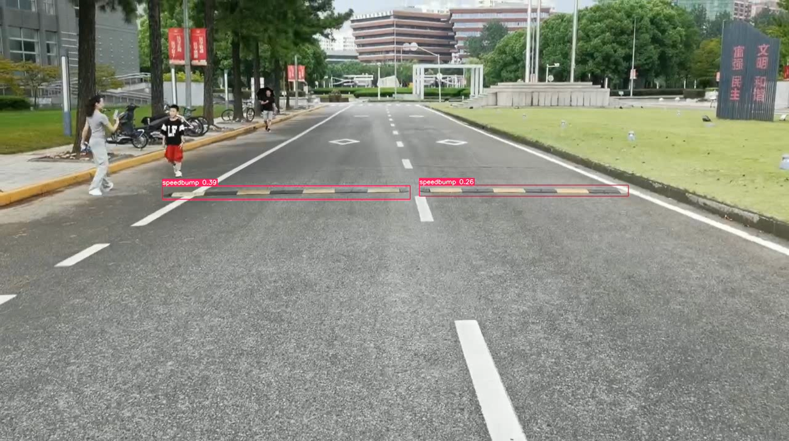

# Homework 3

Tongji University 2022 Class Computer Science and Technology College Software Engineering Major Machine Intelligence Direction Computer Vision Course Assignment

Instructor: Zhang Lin

Semester: 2024-2025 Fall Semester

Student ID: 2251730 Liu Shuyi

## Nonlinear Least Square (NLS) Method

According to the problem, we have:

\[
L(h) = \frac{1}{2} \big( f(x+h) \big)^T f(x+h) + \frac{1}{2} \mu h^T h \quad (1)
\]

\[
= \frac{1}{2} \left( f(x) \right)^{T} f(x) + h^{T} \left( J(x) \right)^{T} f(x) + \frac{1}{2} h^{T} \left( J(x) \right)^{T} J(x) h + \frac{1}{2} \mu h^{T} h \quad (2)
\]

The first derivative can be derived as:

\[
dL = (J(x))^{T}f(x) + (J(x))^{T}J(x)h + \mu h \quad (3)
\]

And the second derivative is:

\[
d^{2}L = (J(x))^{T}J(x) + \mu I \quad (4)
\]

where \(I\) is the identity matrix.

Let \(A = (J(x))^{T}J(x)\), and replace \(J(x)\) with \(J\). We can obtain:

For any \(x \neq 0\), let \(y = Jx\), then:

\[
0 \leq y^{T}y = (Jx)^{T}Jx = x^{T}J^{T}Jx = x^{T}Ax
\]

Thus, \(A\) is positive semi-definite.

For all eigenvalues \((\lambda_{i} \geq 0, i = 1, 2, \cdots, n)\) of \(A\), we have:

\[
Av_{i} = \lambda_{i}v_{i}
\]

And it follows that:

\[
(A + \mu I)v_{i} = (\lambda_{i} + \mu)v_{i}
\]

All eigenvalues of \((A + \mu I)\) satisfy \((\lambda_{i} + \mu) > 0, i = 1, 2, \cdots, n\).

Therefore, \((A + \mu I)\) is positive definite, i.e.:

\[
(J^{T}J + \mu I)
\]

is positive definite.

Since \(d^{2}L = J^{T}J + \mu I\), it can be concluded that \(L(h)\) is a strictly convex function.

## Speed Belt Ranging

After training with YOLO and obtaining the `best.pt` file, the folder contains a test video (HW3_Pro2.mp4) with a bounding box.Below is the effect of one of the frames:

## Experimental Report on 3D Model Scanning and Data Processing

See folder contents for details:.../CV_2251730_Liu Shuyi_Assignment3/HW3_Experiment3.pdf