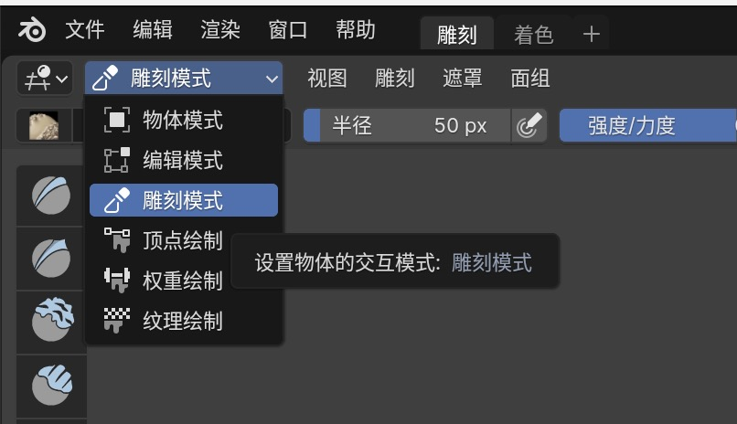

# Homework 3 - Experiment3

姓名：刘淑仪
学号：2251730

## 实验名称

三维模型扫描与数据处理

## 实验目的

1. 了解三维模型数据的表示形式和存储格式； 
2. 掌握手持式三维曲面扫描系统Creaform Go Scan 3D硬件和软件的使用方式； 
3. 掌握常用几何编辑软件（比如GeoMagic Studio）的操作方式，能够对原始三维扫描数据进行简单编辑。 

## 实验设备

1. 硬件：Creaform Go Scan 3D 三维扫描仪； 
2. 软件：Creaform Go Scan 3D 配套扫描软件；
3. 软件：blender-4.2.4

## 实验内容

### 三维扫描仪数据采集流程

1. 启动Creaform Go Scan 3D 配套扫描软件，点击“新会话” -> “扫描”，开始扫描
2. ⼿持三维扫描仪，缓慢移动，直⾄⾯部三维模型扫描完成 注:扫描过程中，若前⽅红灯亮起，表明距离过近，若后⽅红灯亮起，表明距离过远，正常情况下，应当保持只有中间绿灯亮起;若前后两个红灯均亮起，则表明追踪失败，此时可以微调位置，试图重新追踪；若失败，则只能新建会话，重新扫描。
3. 扫描结束，再次点击软件中的“扫描”按钮，选择⽂件格式，导出 3D 模型.obj⽂件

### 三维模型的后处理

1. 进入Blender导入原始的stl文件
   
   

2. 进入编辑模式，进行修补
   
   

3. 最后结果，导出stl文件（对多余部分进行了隐藏操作）。**注：磨皮效果在雕刻模式下效果最好**
   
   
   