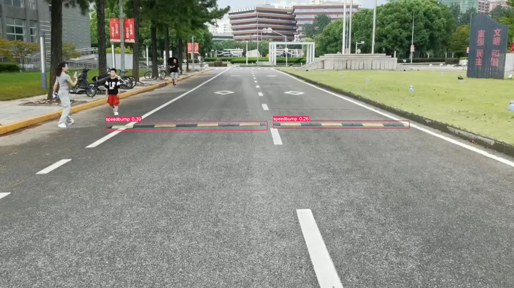

# Homework 3

同济大学 2022级 计算机科学与技术学院 软件工程专业 机器智能方向 计算机视觉课程作业

授课教师：张林

授课学期：2024-2025年度 秋季学期

2251730 刘淑仪

## 非线性最小二乘法

### 题目

假设 \( f(x)=(f_{1}(x),f_{2}(x),...,f_{m}(x)): \mathbb{R}^{n} \rightarrow \mathbb{R}^{m}, x \in \mathbb{R}^{n}, f \in \mathbb{R}^{m} \) 且某些 \( f_{i}(x): \mathbb{R}^{n} \rightarrow \mathbb{R} \) 是非线性函数。那么，问题

\[
x^{*}= \arg \min_{x} \frac{1}{2} \| f(x) \|_{2}^{2} = \arg \min_{x} \frac{1}{2} (f(x))^{T} f(x)
\]

是一个非线性最小二乘问题。在我们的讲座中，我们提到 $Levenberg-Marquardt$ 算法是解决这个问题的典型方法。在L-M算法中，对于每个更新步骤，在当前 \( x \) 处，构建一个局部近似模型为

\[
L(h) = \frac{1}{2} (f(x+h))^{T} f(x+h) + \frac{1}{2} \mu h^{T} h
\]

\[
= \frac{1}{2} (f(x))^{T} f(x)+h^{T} (J(x))^{T} f(x) + \frac{1}{2} h^{T} (J(x))^{T} J(x) h + \frac{1}{2} \mu h^{T} h
\]

其中 \( J(x) \) 是 \( f(x) \) 的雅可比矩阵，且 \( \mu > 0 \) 是阻尼系数。请证明 \( L(h) \) 是一个严格凸函数。（提示：如果一个函数 \( L(h) \) 至少可微到二阶，且其 $Hessian$ 矩阵是正定的，则 \( L \) 是严格凸的。）

### 解答

根据问题，我们有：

\[
L(h) = \frac{1}{2} \big( f(x+h) \big)^T f(x+h) + \frac{1}{2} \mu h^T h \quad (1)
\]

\[
 = \frac{1}{2} \left( f(x) \right)^{T} f(x) + h^{T} \left( J(x) \right)^{T} f(x) + \frac{1}{2} h^{T} \left( J(x) \right)^{T} J(x) h + \frac{1}{2} \mu h^{T} h \quad (2)
\]

可以推导出一阶导数：

\[
dL = (J(x))^{T}f(x) + (J(x))^{T}J(x)h + \mu h \quad (3)
\]

以及二阶导数：

\[
d^{2}L = (J(x))^{T}J(x) + \mu I \quad (4)
\]

其中 \(I\) 是单位矩阵。

设 \(A = (J(x))^{T}J(x)\)，并用 \(J\) 代替 \(J(x)\)，我们可以得到：

对于任意 \(x \neq 0\)，设 \(y = Jx\)，有：

\[
0 \leq y^{T}y = (Jx)^{T}Jx = x^{T}J^{T}Jx = x^{T}Ax
\]

因此，\(A\) 是半正定的。

对于 \(A\) 的所有特征值 \((\lambda_{i} \geq 0, i = 1, 2, \cdots, n)\)，有：

\[
Av_{i} = \lambda_{i}v_{i}
\]

并且可以得到：

\[
(A + \mu I)v_{i} = (\lambda_{i} + \mu)v_{i}
\]

\((A + \mu I)\) 的所有特征值 \((\lambda_{i} + \mu) > 0, i = 1, 2, \cdots, n\)。

因此，\((A + \mu I)\) 是正定的，即：

\[
(J^{T}J + \mu I)
\]

是正定的。

由于 \(d^{2}L = J^{T}J + \mu I\)，可以得出：\(L(h)\) 是一个严格凸函数。

## 减速带测距

在使用YOLO进行训练并获得 `best.pt` 文件后，文件夹中包含一个带有边界框的测试视频（HW3_Pro2.mp4）。以下是其中一帧的效果：

## 三维模型扫描与数据处理实验报告

详见文件夹内容：../CV_2251730_刘淑仪_Assignment3/HW3_Experiment3.pdf